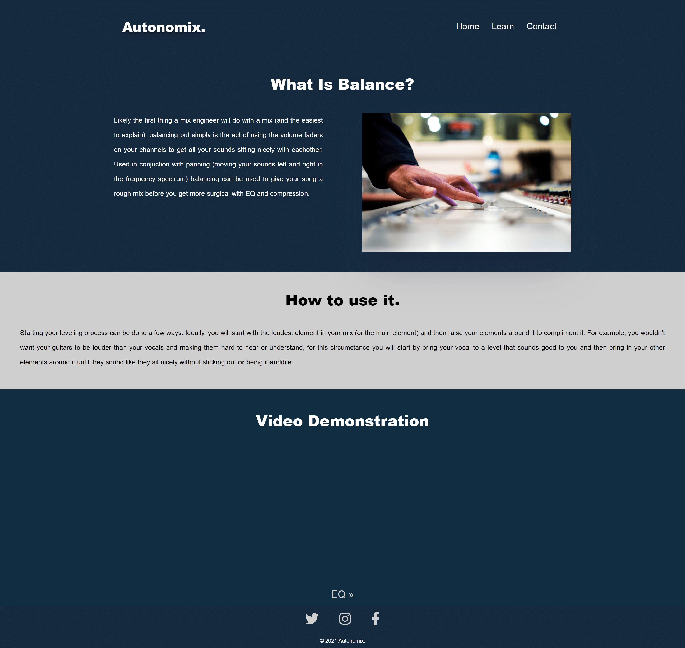

# Autonomix. 

# Table Of Contents

- [Overview](#overview)
- [UX](#ux)
- [Features](#features)
- [Technologies Used](#technologies-used)
- [Resources](#resources)
- [Testing](#testing)
- [Code Validation](#code-validation)
- [Deployment](#deployment)
- [Credits](#credits)

# Overview

- This is a site for teaching basics of audio mixing, this is also my first milestone project for Code Institute's Fullstack Software Development course. The project was used to demonstrate the skills and knowledge of using HTML5 and CSS to create a static frontend website. 

- Many people write, record and producer their own music at home but don't know how to mix their elements to make their music sound good, Autonomix will have the beginner info to get them started. With my experience in the music industry as a mix engineer I felt this would be the perfect first step into software development, with it being something I'm both passionate about and that I wish I had when I began music production and audio mixing. 

# UX

The layout for Autonomix is simple, starting with a landing page with basic info about mixing as a concept followed by buttons that take the user directly to the topics they came to read about. Quick and easy. The learning pages will then contain a short body of text describing the concept of the technique, an explanation on how to use the technique and finally a video demonstration explaining the topic so that user's can hear and see it in use. 

## User Goals

Users are looking to:

- Learn to mix music with the basic techniques.
- See how see how the techniques are implemented by a professional.
- Contact the site with any additional questions.
- Use a site designed for any devive they could be viewing from.
- Easy to find social media links to follow Autonomix online.

## User Stories

1. As a user, I want to learn basic mixing techniques, so I can learn how to mix my own music. 
2. As a user, I want to find specific techniques inside the site, so I can focus on the topics that I don’t understand as well as others.
3. As a user, I want video explanations/examples, so I can hear and see the techniques in action to assist my learning.
4. As a user, I want to be able to contact the site owners, so I can submit my mixes and ask for advice.
5. As a user, I want to be able to navigate the tutorial pages to progress through the steps.

## Site owner goals

- To teach the beginner concepts of audio mixing
- Provide both text and video explanations
- Include a contact page for users to get in touch with their queires

## Design

- Colour Scheme
   - The main colours used for the site are a deep blue and off white. 

- Typography
   - The font for headings is Montserrat and for the body is Work Sans, with the fallback for both being sans-serif. 

The wireframes for Autonomix can be viewed [here](https://www.dropbox.com/s/2ybowtp4rlgvrix/autonomix_wireframes.pdf?dl=0).

# Features

### Navigation:
- Site logo provides link to home page
- The learn button in the nav bar creats a drop down menu with access to learning pages
- Nav links drop below site name on mobile devices

### Footer:
- Contains social media links

### Home Page:
- Hero image with photo of mix engineer to draw users in
- Websites tagling in the middle of the hero image
- Brief intro to mixing as a concept
- Large buttons at the bottom of the page to navigate to learning pages

### Learning Pages:
- Short and concise explanations of techniques.
- Video explanations.

### Contact Page:
- Form to get in contact with owners about any queries

### Future Features:
- Mix submission form to request feedback
- Interactive mixing tools for learning
- Additional learning pages containing more advanced topics/techniques

# Technologies Used

1. Languages 
   - HTML5 - the current standard.
   - CSS - the current standard.

2. Integrations
   - Font Awesome - Icons used for social media links in the footer.
   - Google Fonts - used to import the typography used to create the text.

4. Workspace, Version Control and Repository
   - GitPod - IDE used to create the project.
   - Git - Version control tool used to track versions/changes. 
   - GitHub - Hosting service used to manage the git repositories. 

# Resources

- Code Institute Course - Knowledge of HTML and CSS learned from here
- Slack Community - Assistance 
- Balsamiq - Used to create wireframes
- [Am I Responsive](http://ami.responsivedesign.is/#) - Used to see how the site would look on different devices
- Google Chrome Developer Tools - Used to debug the CSS and try out other stylings on the fly
- [Unsplash](https://unsplash.com/) - Stock image site
- [W3Schools](https://w3schools.com) - General knowledge
- [Colours Cafe Instagram Account](https://www.instagram.com/colours.cafe/) - Inspiration for color scheme
- [TinyPNG](https://tinypng.com/) - Used to compress images for the site

# Testing

The same testing process was done across various browsers and devices, for the full testing process click [here](TESTING.md).

# Code Validation 

- HTML - [W3C HTML Validator](https://validator.w3.org/)
- CSS - [Jigsaw CSS Validator](https://jigsaw.w3.org/css-validator/)

# Deployment

This project was deployed to the internet using the built in Pages feature on GitHub using the following steps: 

   - Code was written in GitPod.
   - Code pushed to GitHub [repository](https://github.com/hollownotempty/autonomix_project_1) using git.
   - From the repository page I clicked on the 'Settings' menu.
   - Navigated to the 'Pages' tab.
   - Opened the menu underneath 'Source' and select 'Master'.
   - This published the site on GitHub pages and shows the link to access it.

# Credits 

## Code Snippets

- [W3Schools](https://www.w3schools.com/cssref/css3_pr_box-shadow.asp) - Explanation on how to make box shadows.
- [Easy Tutorials](https://www.youtube.com/watch?v=wHFflWvii3M&t=814s) - For how to make the drop down menu in the nav.

## Media 

- All images sourced from [Unsplash](https://unsplash.com/) and [Ableton's website](https://ableton.com).
- This project was inspired by [URM](https://urm.academy/) and [Izotope](https://www.izotope.com/en/learn.html). 

## Acknowledgements 

I would like to thank my mentor Akshat Garg for his guidance and advice and the Code Institute Slack Community for support with project related frustrations. 
