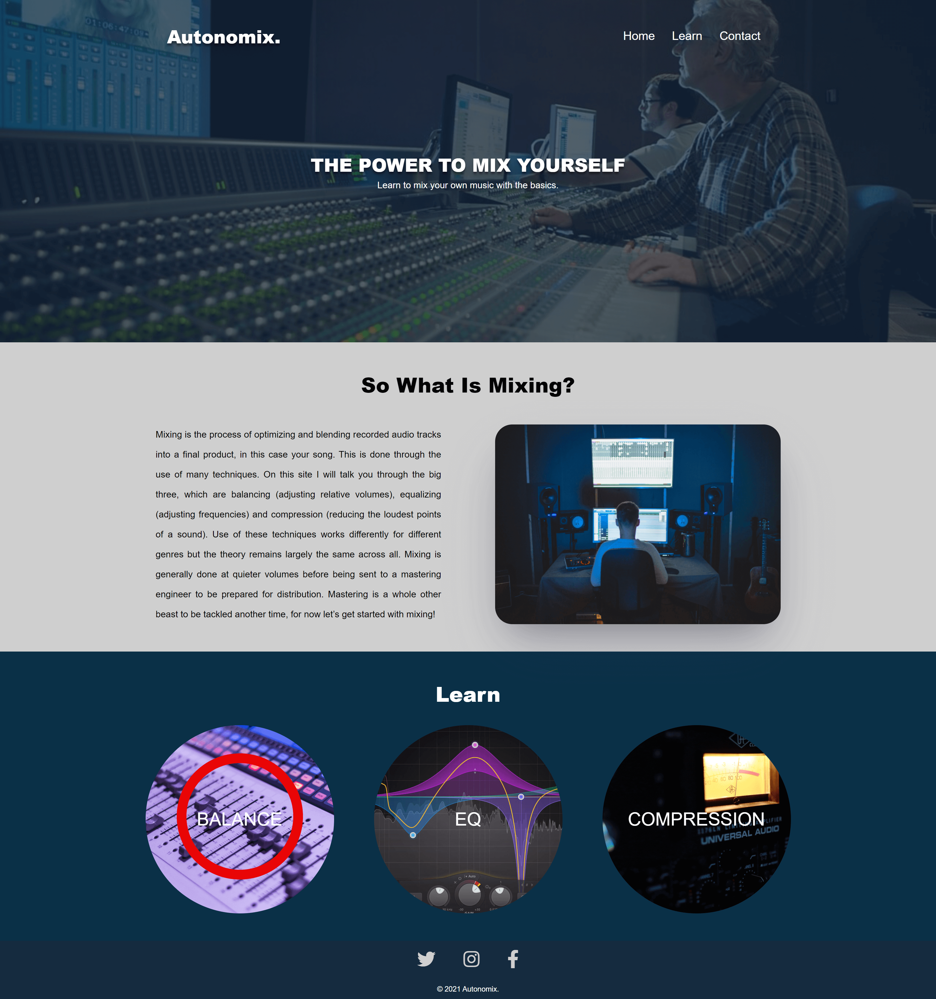
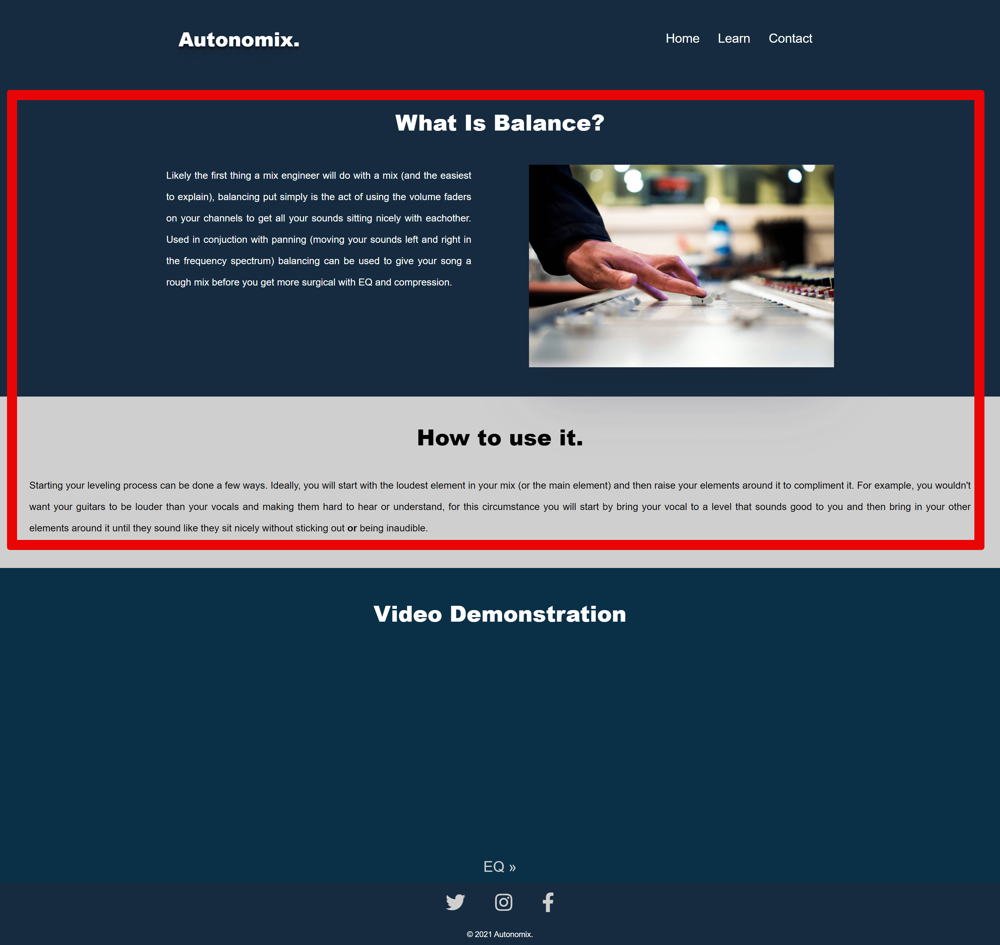
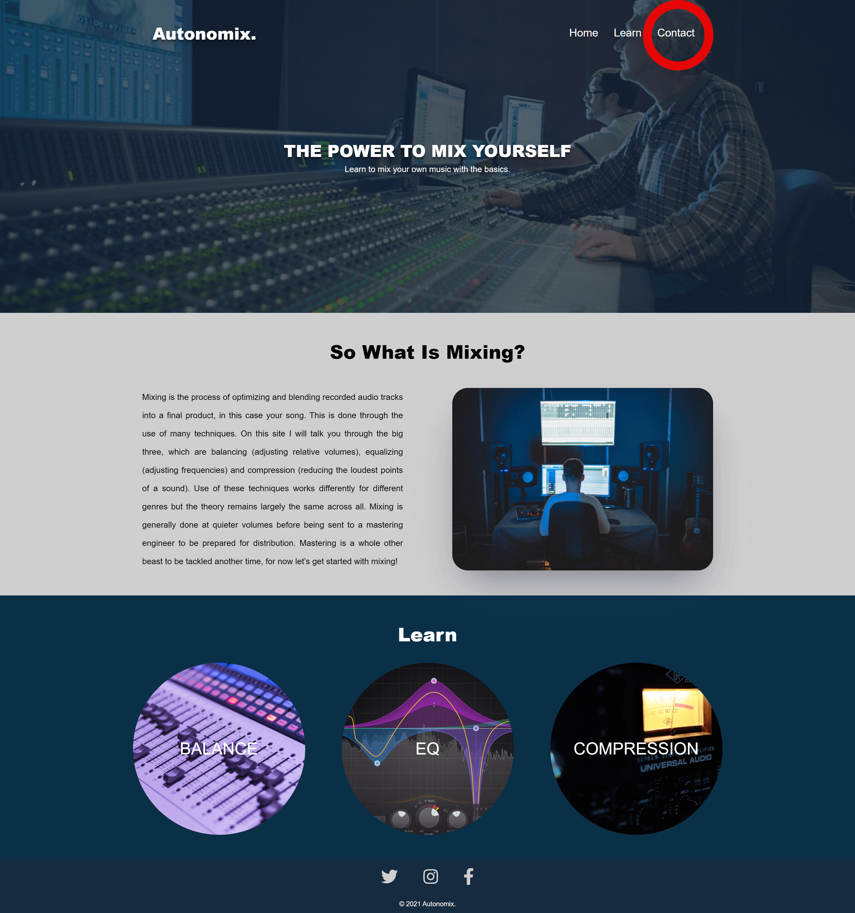
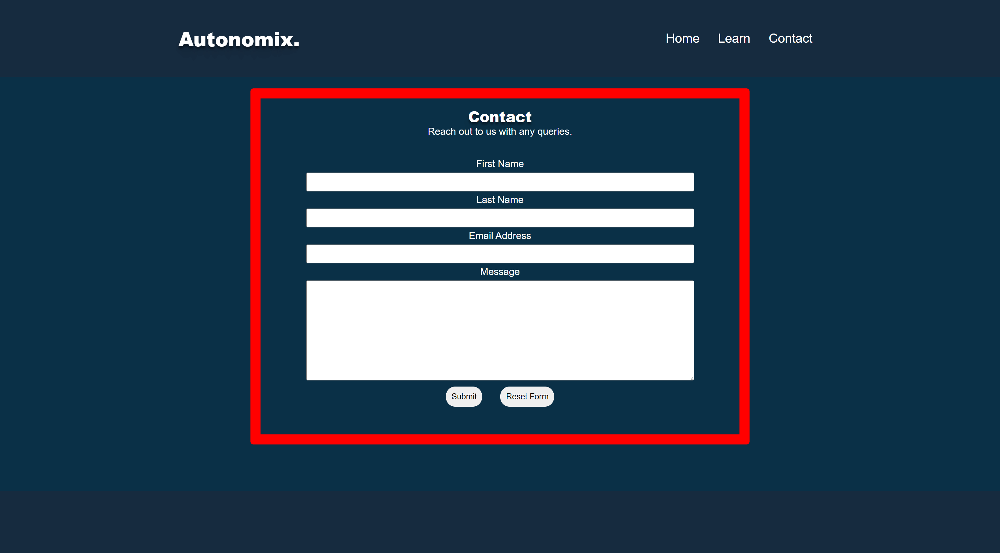
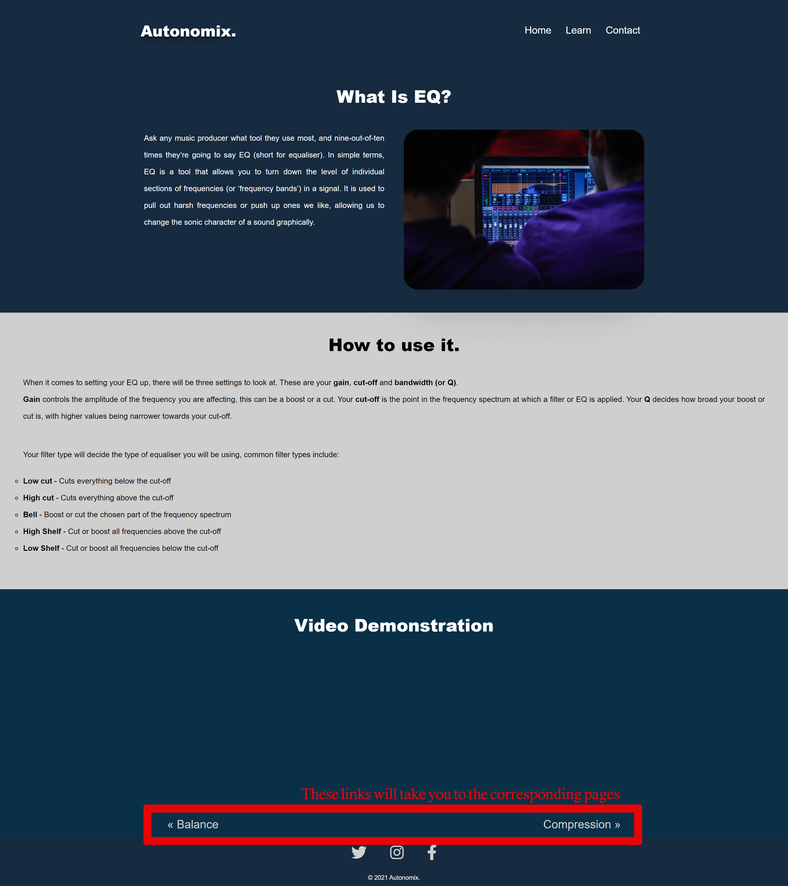
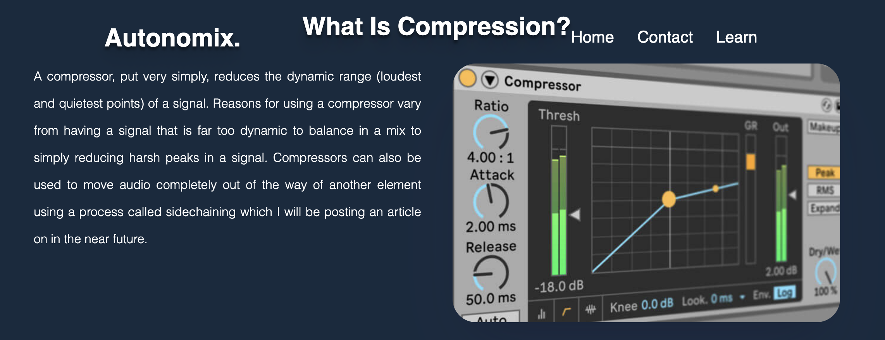
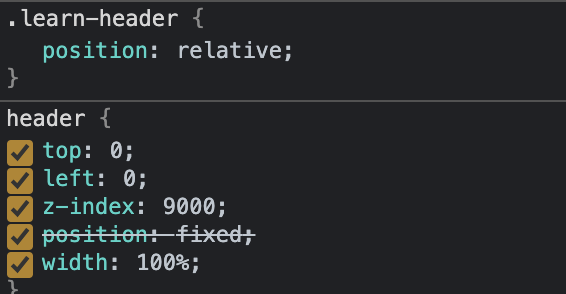
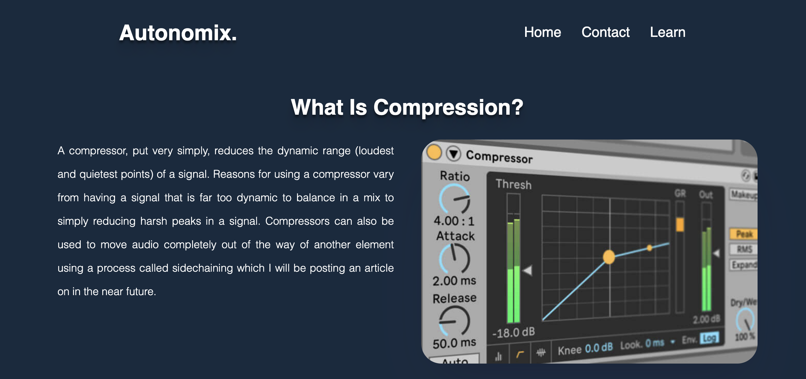
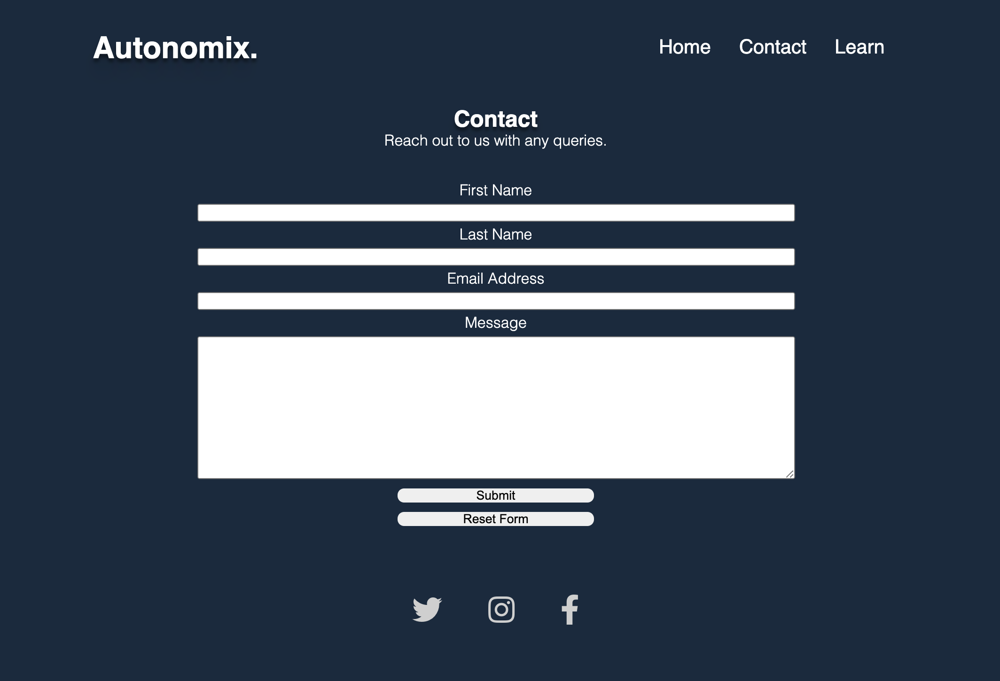
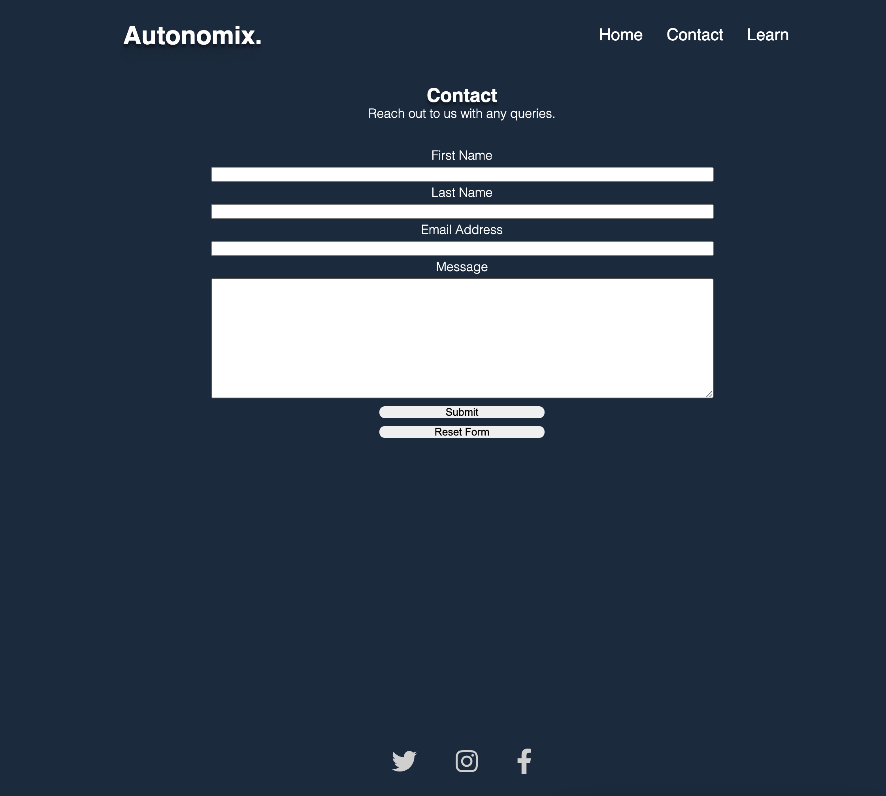

# Testing

To test the site, a sequence of steps were followed across various browsers and devices. The steps were as follow: 

 - Validate HTML and CSS using their respective validators.
 - All pages were checked to make sure that layout matched the [wireframes](https://www.dropbox.com/s/2ybowtp4rlgvrix/autonomix_wireframes.pdf?dl=0). 
 - All text was read through to be certain it was easy to read, understand and has no spelling or grammar errors.
 - Make sure that all images load in within a reasonable amount of time. 
 - Make sure correct page name is displayed in the tab (eg. Home | Autonomix.)

# User Stories 

The following are the steps I took to make sure the user stories listed in the [README.md](README.md/#UX) were fulfilled in the site:

*Numbers align with their respective User Story*

1. From the home page, I scroll down to the learn section (or hover over the learn nav link) and click on the topic I want to read about.
    
    
2. If I want to specifically learn about Balance, EQ or Compression I go to the previously mentioned learn sections and click on the specific topic I want. 
3. After reading about the topic I have clicked on, I can scroll to the bottom of the topic page and watch the linked video on the topic. 
4. To contact the site, I go to the navigation bar and click contact, fill out the form that appears on screen and hit submit. 
    
    
5. If I am on a tutorial page and decide I want to progress forward or back to a different topic, I can click the arrows at the bottom of the page to navigate to the desired page.
    

# Bugs

1. Content on the learn pages would clip upwards into the header due to the Fixed position from the css. 
 
The solution for this was to give the headers in the learn pages a utility class with which the position is set to Relative.

You can see below that this fixed the issue easily. 

2. The footer on the contact page was far too high (right underneath the form). 

To solve this, a min-height property was added to the form with a value of calc(100vh - 320px) to create a gap between the form and the footer. 

# Browsers

- Chrome
- Firefox
- Brave
- Safari
- Opera

# Devices

- ACER Computer monitor
- iPhone 11
- Macbook Pro 2018
- iPad 2
- iPad Mini